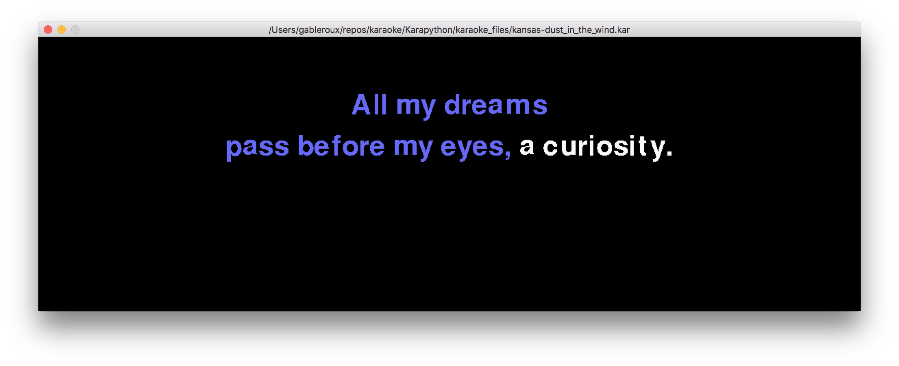

# Karapython

## Main application

:microphone: A Python Karaoke application written in Python on top of [pygame](pygame) to let you sing like never before.



### Getting started

It is recommanded you use a [virtualenv](http://docs.python-guide.org/en/latest/dev/virtualenvs/). See [#1](https://github.com/hsocasnavarro/Karapython/issues/1), _it currently only supports Python2.7_. Help is welcome :v:

```bash
pip install -r requirements.txt
python main.py
```

### Bring this project to life

Here's a few things that could be done to improve this a little :rocket:

- [x] File prompt to select karaoke songs! (still needs some improvements)
- [ ] Allow Pausing the song
- [ ] Allow Opening a new song without quitting the app
- [ ] Display informations for the currently playing song
- [ ] Playlist support
- [ ] Maybe add some visualisation
- [ ] Create a gh-pages page to get some visibility
- [ ] Migrate to Python3 (see [#1](https://github.com/hsocasnavarro/Karapython/issues/1))
- [ ] Add tests

And way more. PRs welcome!

## The Karaoke file Library

See [midifile.py](midifle.py)

Python module to read karaoke `.kar` files (and also regular midi `.mid` files). Use it to build your own application or check the stand-alone player in the examples. The module can parse MIDI files and can be useful for other applications too, as it provides the information of each note, including real time on and off setting.

### Examples

Check the very simple [examples/](examples) to see how this module can be used to implement a karaoke application
- [examples/example1.py](examples/example1.py) is an extremely simple text-based karaoke application that runs on the console. It doesn't play any music, just shows the lyrics. It has no additional requirements.

The following example requires [pygame](pygame)

- [examples/example2.py](examples/example2.py) adds music to it using [pygame](pygame). 
- [examples/example3.py](examples/example3.py) shows how to use [pygame](pygame) to build a graphic frontend for a karaoke application.

### Module documentation

This module defines the class midifile which may be used to parse and
extract information from MIDI (.mid) files and Karaoke (.kar) files. 
This can be useful to analyze a MIDI file or as a back-end for a
karaoke player. The class midifile creates an object that is associated
to the MIDI (or .kar) file being parsed. The following instance attributes
are defined:

#### Attributes

        fileobject: A file type associated to the .mid or .kar file

        error : Error condition upon exit from the class methods. It's False
      if no error or some other type depending on the error condition

    Tempo-related quantities: The tempo can change at any time, so the
      following quantities related to the tempo are defined as a list
      containing all the values taken and the real time (in seconds)
      at which something related to the tempo changed. For instance,
      if we have a song with three different values of the BPM (say,
      it started at 60, changed to 90 after two mintes and then went
      back to 90 after 30 seconds), we have that all tempo-related
      variables are lists of three elements. Each element is, in turn,
      a list of two elements. The first element is the value itself and
      the second is the real time at which it changed. So in this example
      we would have bpm=[ [60,0.], [90,120], [60,150] ]
     
        bpm=[[120,0.]] # Midi default

    	microsecondsperquarternote=[[60000000./120,0.]] # Midi default

	num=[[4, 0.]] # Midi default

    	den=[[4, 0.]] # Midi default
    
    For karaoke .kar files
    	karfile=Boolean that indicates whether the file has karaoke 
     information in the .kar format

     	kartrack=Track number (starting with 0) with the karaoke information

    	karsyl=List of strings with the kar syllabes 

    	kartimes=list of strings with the real-time (in seconds) associated 
     to the kar syllabes

     	karlinea=A list of three strings corresponding to the three lines
     that can be displayed in the karaoke. Note: Three lines is the 
     maximum that this program can handle!! Here we have the part of the
     text that has already been read and is usually displayed in a different
     color.    

    	karlineb=Same as above but for the text that has not yet been read
     (usually displayed by karaokes on white color). As time goes by, 
     syllabes from this string are removed and appended to the karlinea
     string above

    Track information
       ntracks=Number of tracks in the file

       tracknames=List of strings with the names of each track

    MIDI note information 
       patchesused=A list of lists, each element
       containing the patches (instruments) used in the file, the
       track number in which it was used and the time at which the
       midi program change event was recorded

       notes=A list containing the note events. Each element has the
     information for each note played, with the following values:
     [note_number, velocity, patch, track, time_start, time_end]
     time_start and time_end are real time in seconds. Time_end
     is the time in which a note_off event (or a note_on with 0 velocity)
     was registered for this note. Some notes may not have an associated
     note_off event, in which case, time_end is set to -1. If two
     note_on events are registered for the same note without a note_off
     event in between, then the time_end for the first note is set to
     the time_start of the second note. Note on and note off matching is 
     done across tracks but not across patches, so a piano C4 is not 
     considered the same note as a guitar C4.

#### Methods

   The following methods are exposed by the class:

   load_file() : This method parses the .mid or .kar file and sets
     the corresponding class attributes. Should be called before
     using any of the attributes.

   update_karaoke(dt): The input argument dt is a float with the time
     in seconds elapsed since the start of the song. This method then
     checks the karaoke information and updates the related attributes 
     (particularly karlinea and karlineb) so that they can be used
     by the caller. Need to have run load_file() before.

   write_file(filein, fileout, tracks2remove, patches2remove): This
     method replicates a MIDI or karaoke file with the option to
     supress one or more tracks and/or instruments. filein and fileout
     are strings with the corresponding filenames (filein must exist and
     fileout will be overwritten). tracks2remove and patches2remove may
     be either None or a list (can be an empty list) of integers with
     the numbers of tracks or instruments that are not wanted in the
     output file.


#### Examples

     In this repository there are some very simple examples that illustrate
     possible use cases. example1.py is an extremely simple text-based
     karaoke application that runs on the console. It doesn't play any
     music, just shows the lyrics. It has no additional requirements. 
     example2.py adds music to it using pygame. Requires: pygame. 
     example3.py shows how to use pygame to build a graphic frontend for
     a karaoke application. Requires: pygame.

## License

MIT © [Hector Socas-Navarro](https://github.com/hsocasnavarro)

